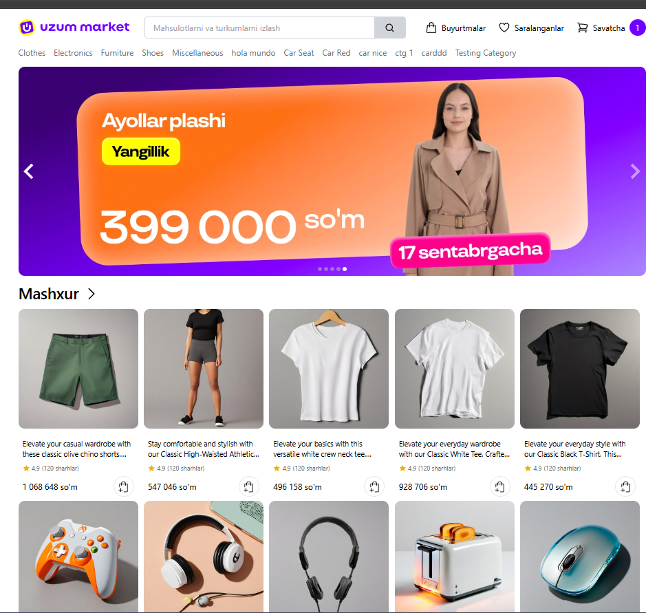

# Uzum Market Clone

<p align="center">
	
</p>

<p align="center">
	Uzum Market uslubidan ilhomlangan zamonaviy e-commerce frontend clone.
</p>

<p align="center">
	
	
	
	
</p>

## Preview


## About

Bu loyiha Uzum Market uslubidagi frontend clone bo'lib, unda mahsulotlar ro'yxati, product detail sahifasi va cart sahifasi mavjud.

Asosiy texnologiyalar: React, TypeScript, Vite, Tailwind CSS va Axios.

## Run Project

Dependencies o'rnatish:

```bash
npm install
```

Development server ishga tushirish:

```bash
npm run dev
```

Production build yaratish:

```bash
npm run build
```

Build preview ko'rish:

```bash
npm run preview
```
